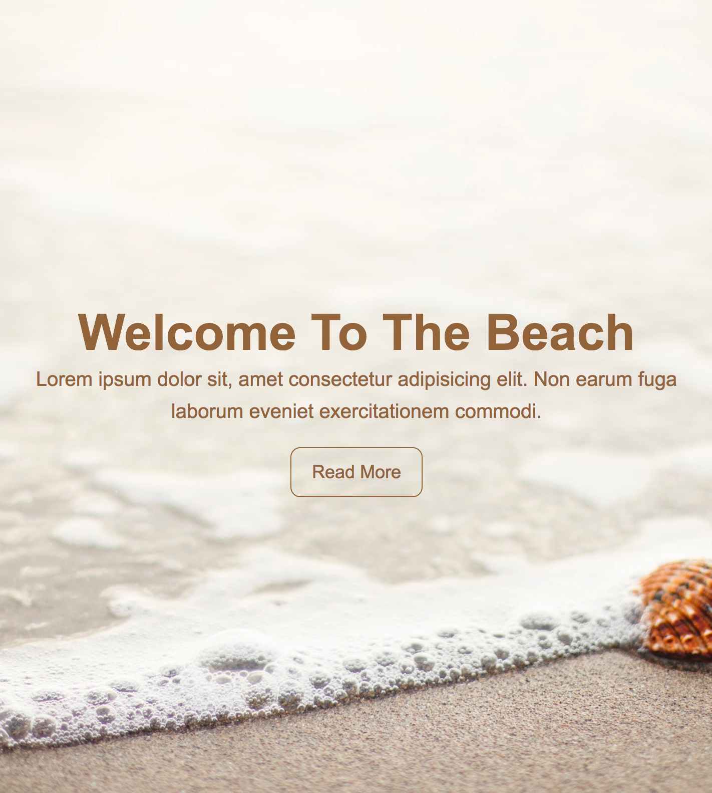

# [Easy Fullscreen Landing Page With HTML & CSS](https://www.youtube.com/watch?v=hVdTQWASliE)

In this small project I will show you how to create a simple HTML/CSS landing page with a fullscreen image in the background. We will also use a little bit of flexbox styling.

[View demo site here.](https://webdevtuts.github.io/fullscreen_landing_page/)

